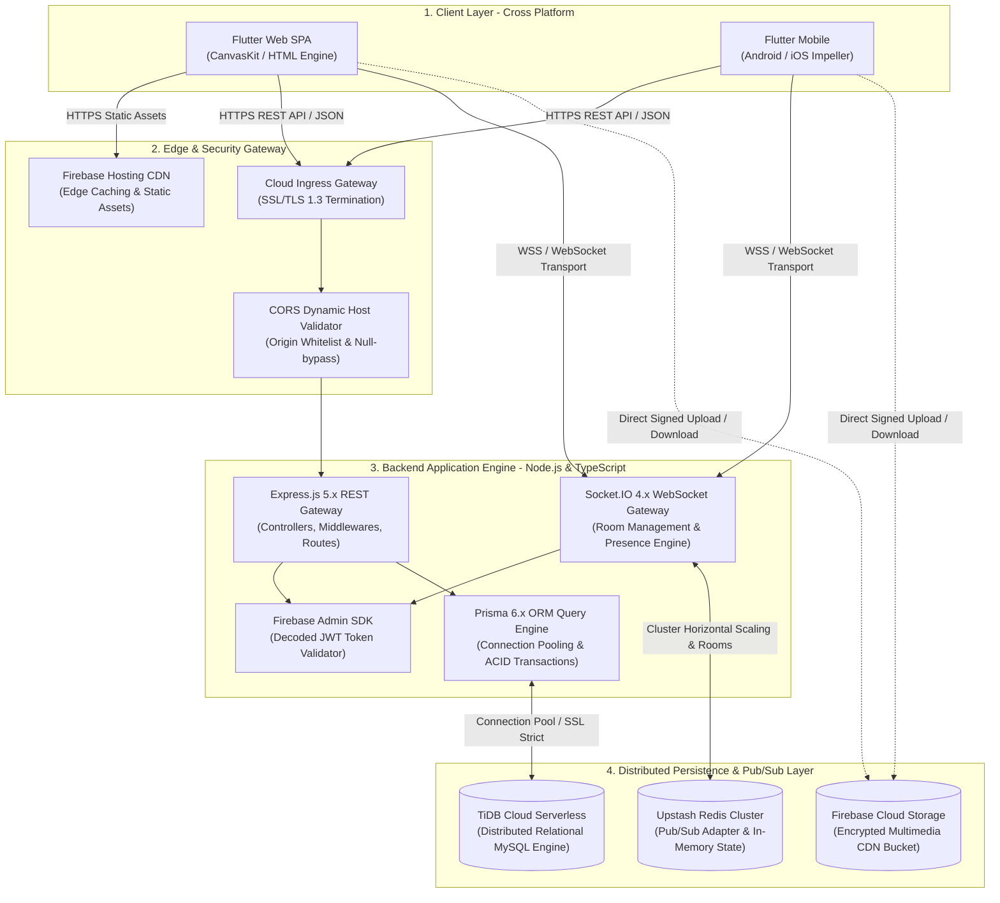
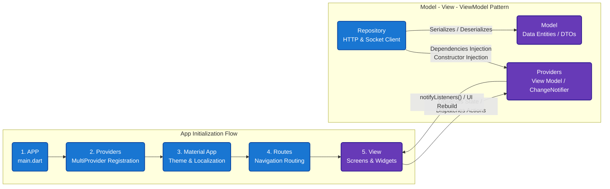
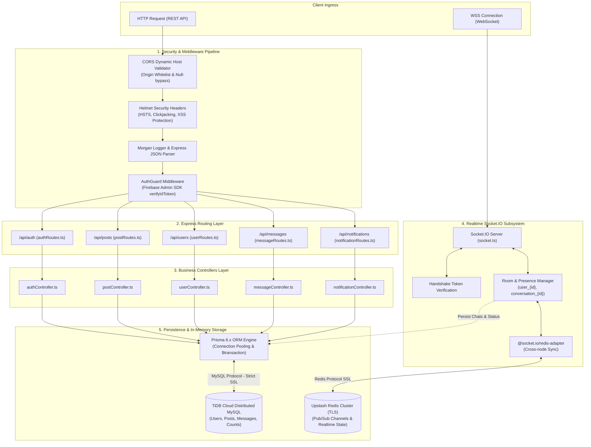
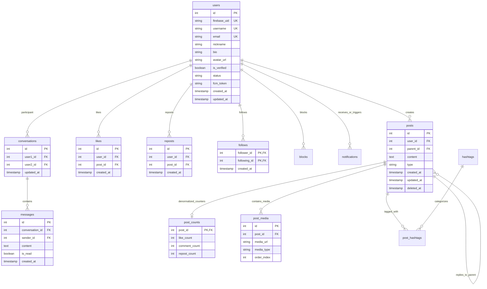
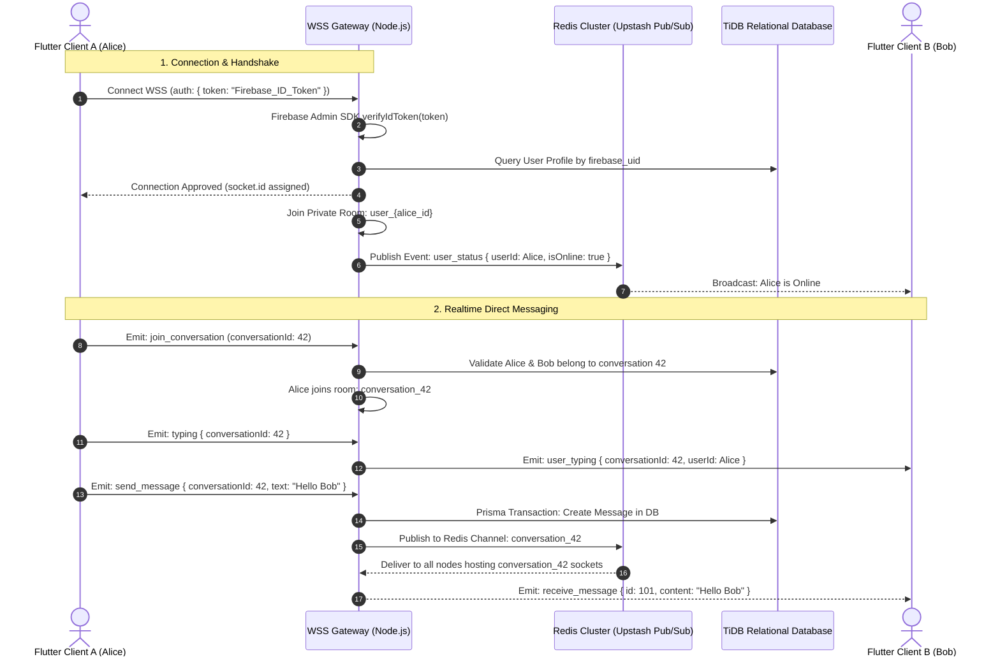

# 🧵🏙️ Thread City - Scalable Realtime Social Network Engine & Multi-Platform Client

[Tiếng Việt](README.md) • [English](README.en.md) • [日本語](README.ja.md)

---

> **Thread City** is a modern, high-concurrency micro-blogging social network platform engineered for both Web SPA and Native Mobile (Android/iOS). Built with enterprise-grade software design principles, it features a Layered Clean Architecture, Denormalized Counter Caching for $O(1)$ feed reads, Distributed Realtime Synchronization via Redis Pub/Sub, and Hybrid Cryptographic Authentication.

---

## 🌐 1. Live Production System

The entire infrastructure is deployed and operating 24/7 online independently on the Cloud:

* 🖥️ **Web Application (Production Client)**: [https://thread-b4d7b.web.app](https://thread-b4d7b.web.app)
* ⚡ **Core Backend API Gateway (Cloud Engine)**: `https://<backend-host>.onrender.com` *(Protected Instance - Rate Limited & Zero-Trust Auth)*
* 🔌 **Realtime WebSocket Gateway**: `wss://<backend-host>.onrender.com` *(Stateful Bi-directional Pub/Sub Node)*
* 🗄️ **Distributed Database Node**: TiDB Cloud Distributed MySQL Cluster (`ap-southeast-1` - Singapore)
* ⚡ **In-Memory Cache & Pub/Sub Cluster**: Upstash Redis Enterprise with TLS Encryption (`ap-southeast-1` - Singapore)
* 🛡️ **Identity & Media Storage**: Firebase Spark Infrastructure (Auth, Realtime DB, Storage Bucket, FCM)

---

## 🏛️ 2. High-Level System Architecture

The architecture follows a **Distributed Monolith Ready-to-Microservices** topology, strictly separating responsibilities across Client, Edge/Gateway, Application Server, In-memory Broker, and Persistent Storage.


```mermaid
graph TD
    subgraph ClientLayer ["1. Client Layer - Cross Platform"]
        WebClient["Flutter Web SPA<br/>(CanvasKit / HTML Engine)"]
        MobileClient["Flutter Mobile<br/>(Android / iOS Impeller)"]
    end

    subgraph EdgeLayer ["2. Edge & Security Gateway"]
        CDN["Firebase Hosting CDN<br/>(Edge Caching & Static Assets)"]
        ReverseProxy["Cloud Ingress Gateway<br/>(SSL/TLS 1.3 Termination)"]
        CORS["CORS Dynamic Host Validator<br/>(Origin Whitelist & Null-bypass)"]
    end

    subgraph AppLayer ["3. Backend Application Engine - Node.js & TypeScript"]
        ExpressApp["Express.js 5.x REST Gateway<br/>(Controllers, Middlewares, Routes)"]
        SocketEngine["Socket.IO 4.x WebSocket Gateway<br/>(Room Management & Presence Engine)"]
        AuthGuard["Firebase Admin SDK<br/>(Decoded JWT Token Validator)"]
        PrismaEngine["Prisma 6.x ORM Query Engine<br/>(Connection Pooling & ACID Transactions)"]
    end

    subgraph DataLayer ["4. Distributed Persistence & Pub/Sub Layer"]
        RedisCluster[("Upstash Redis Cluster<br/>(Pub/Sub Adapter & In-Memory State)")]
        DistributedDB[("TiDB Cloud Serverless<br/>(Distributed Relational MySQL Engine)")]
        MediaStorage[("Firebase Cloud Storage<br/>(Encrypted Multimedia CDN Bucket)")]
    end

    WebClient -->|"HTTPS Static Assets"| CDN
    WebClient -->|"HTTPS REST API / JSON"| ReverseProxy
    MobileClient -->|"HTTPS REST API / JSON"| ReverseProxy
    WebClient -->|"WSS / WebSocket Transport"| SocketEngine
    MobileClient -->|"WSS / WebSocket Transport"| SocketEngine

    ReverseProxy --> CORS
    CORS --> ExpressApp

    ExpressApp --> AuthGuard
    SocketEngine --> AuthGuard

    ExpressApp --> PrismaEngine
    SocketEngine <-->|"Cluster Horizontal Scaling & Rooms"| RedisCluster
    PrismaEngine <-->|"Connection Pool / SSL Strict"| DistributedDB
    WebClient -.->|"Direct Signed Upload / Download"| MediaStorage
    MobileClient -.->|"Direct Signed Upload / Download"| MediaStorage
```

---

## 📱 3. Client Architecture: App Flow & MVVM Pattern

The Flutter Client is organized strictly under the **MVVM (Model - View - ViewModel)** pattern with **Dependency Injection (DI)** and a unidirectional initialization pipeline:


```mermaid
flowchart LR
    subgraph AppFlow ["App Initialization Flow"]
        direction LR
        APP("1. APP<br/>main.dart") --> ProvidersInit("2. Providers<br/>MultiProvider Registration")
        ProvidersInit --> Material("3. Material App<br/>Theme & Localization")
        Material --> Routes("4. Routes<br/>Navigation Routing")
        Routes --> View("5. View<br/>Screens & Widgets")
    end

    subgraph MVVMArchitecture ["Model - View - ViewModel Pattern"]
        direction LR
        View -->|"Observes State / Dispatches Actions"| ProvidersVM("Providers<br/>View Model / ChangeNotifier")
        Repo("Repository<br/>HTTP & Socket Client") -->|"Dependencies Injection<br/>Constructor Injection"| ProvidersVM
        Repo -->|"Serializes / Deserializes"| Model("Model<br/>Data Entities / DTOs")
        ProvidersVM -->|"notifyListeners() / UI Rebuild"| View
    end

    classDef blueBox fill:#1976D2,stroke:#0D47A1,stroke-width:2px,color:#fff;
    classDef purpleBox fill:#673AB7,stroke:#311B92,stroke-width:2px,color:#fff;
    class APP,ProvidersInit,Material,Routes,Repo blueBox;
    class View,ProvidersVM,Model purpleBox;
```

### Execution & Interaction Flow:
1. **Application Bootstrap (`App Flow`)**:
   * `APP (main.dart)`: Initializes core platform bindings, registers the Firebase Client SDK, and loads compile-time environment configuration from `AppConfig`.
   * `Providers (MultiProvider)`: Registers and injects all core ViewModels (`AuthProvider`, `HomeProvider`, `PostProvider`, `MessageProvider`, `NotificationProvider`).
   * `Material App`: Configures Design Tokens, Typography, Color Palette, and Root Navigator.
   * `Routes`: Handles strongly-typed named screen transitions.
   * `View`: Pure declarative widgets displaying UI state.
2. **MVVM & Dependency Injection**:
   * **View**: Binds to ViewModel states via `Consumer` / `context.watch()` and triggers intents via `context.read()`.
   * **View Model (`Providers`)**: Manages domain state and issues `notifyListeners()` to rebuild only the affected widgets.
   * **Dependencies Injection (DI)**: Standalone `Repository` instances are injected directly into Provider constructors, decoupling networking from business logic.
   * **Model**: Strongly-typed immutable DTOs supporting bidirectional JSON serialization.

---

## ⚙️ 4. Server Internal Architecture & Request Pipeline

The Node.js/TypeScript backend implements a **Middleware Pipeline** and **Layered Controller-Service-Repository-ORM** architecture:


```mermaid
flowchart TD
    subgraph ClientReq ["Client Ingress"]
        HTTPReq["HTTP Request (REST API)"]
        WSReq["WSS Connection (WebSocket)"]
    end

    subgraph SecurityPipeline ["1. Security & Middleware Pipeline"]
        CORS["CORS Dynamic Host Validator<br/>(Origin Whitelist & Null-bypass)"]
        Helmet["Helmet Security Headers<br/>(HSTS, Clickjacking, XSS Protection)"]
        Logger["Morgan Logger & Express JSON Parser"]
        AuthGuard["AuthGuard Middleware<br/>(Firebase Admin SDK verifyIdToken)"]
    end

    subgraph RouterLayer ["2. Express Routing Layer"]
        AuthRouter["/api/auth (authRoutes.ts)"]
        PostRouter["/api/posts (postRoutes.ts)"]
        UserRouter["/api/users (userRoutes.ts)"]
        MsgRouter["/api/messages (messageRoutes.ts)"]
        NotiRouter["/api/notifications (notificationRoutes.ts)"]
    end

    subgraph ControllerLayer ["3. Business Controllers Layer"]
        AuthCtrl["authController.ts"]
        PostCtrl["postController.ts"]
        UserCtrl["userController.ts"]
        MsgCtrl["messageController.ts"]
        NotiCtrl["notificationController.ts"]
    end

    subgraph RealtimeSubsystem ["4. Realtime Socket.IO Subsystem"]
        SocketGateway["Socket.IO Server (socket.ts)"]
        SocketAuth["Handshake Token Verification"]
        RoomManager["Room & Presence Manager<br/>(user_{id}, conversation_{id})"]
        RedisAdapter["@socket.io/redis-adapter<br/>(Cross-node Sync)"]
    end

    subgraph PersistenceLayer ["5. Persistence & In-Memory Storage"]
        PrismaORM["Prisma 6.x ORM Engine<br/>(Connection Pooling & $transaction)"]
        TiDBDB[("TiDB Cloud Distributed MySQL<br/>(Users, Posts, Messages, Counts)")]
        UpstashRedis[("Upstash Redis Cluster (TLS)<br/>(Pub/Sub Channels & Realtime State)")]
    end

    HTTPReq --> CORS
    CORS --> Helmet
    Helmet --> Logger
    Logger --> AuthGuard

    AuthGuard --> AuthRouter
    AuthRouter --> AuthCtrl

    AuthGuard --> PostRouter
    PostRouter --> PostCtrl

    AuthGuard --> UserRouter
    UserRouter --> UserCtrl

    AuthGuard --> MsgRouter
    MsgRouter --> MsgCtrl

    AuthGuard --> NotiRouter
    NotiRouter --> NotiCtrl

    WSReq --> SocketGateway
    SocketGateway <--> SocketAuth
    SocketGateway <--> RoomManager
    RoomManager <--> RedisAdapter
    RedisAdapter <-->|"Redis Protocol SSL"| UpstashRedis

    AuthCtrl --> PrismaORM
    PostCtrl --> PrismaORM
    UserCtrl --> PrismaORM
    MsgCtrl --> PrismaORM
    NotiCtrl --> PrismaORM
    RoomManager -.->|"Persist Chats & Status"| PrismaORM
    PrismaORM <-->|"MySQL Protocol - Strict SSL"| TiDBDB
```

---

## 🛠️ 5. Technology Stack & Technical Rationale

| Layer | Chosen Technology | Engineering Rationale & Technical Advantage |
| :--- | :--- | :--- |
| **Frontend Framework** | **Flutter 3.x (Dart)** | Unified single codebase for Web, Android, and iOS; native rendering performance reaching 60–120 FPS via Impeller/CanvasKit graphics engines. |
| **State Management** | **Provider + ChangeNotifier** | Reactive state pattern isolating business logic from UI widgets; scoped lifecycle management minimizing widget rebuild overhead. |
| **Backend Runtime** | **Node.js (v20+) + TypeScript** | Non-blocking asynchronous I/O event loop capable of handling thousands of concurrent connections. Strict typing under `NodeNext` ESM module resolution. |
| **REST Framework** | **Express.js 5.x** | Improved routing performance, native promise support within middlewares preventing unhandled asynchronous rejections. |
| **ORM Framework** | **Prisma 6.x** | Complete Type-Safe data access layer generated directly from schema definitions; supports atomic transactions (`$transaction`) for nested writes. |
| **Relational Database** | **TiDB Cloud (Distributed MySQL)** | Serverless MySQL-wire compatible database with horizontal auto-scaling; eliminates Single Point of Failure (SPOF) while guaranteeing ACID compliance. |
| **Realtime Gateway** | **Socket.IO 4.x + Redis Adapter** | Combines bi-directional WebSocket transport with Redis Pub/Sub for multi-instance cluster synchronization and horizontal scalability. |
| **In-Memory Store** | **Upstash Redis (TLS Protocol)** | Sub-millisecond latency for Pub/Sub messaging and chat room session management; secured via `rediss://` SSL encrypted protocol. |
| **Identity & Security** | **Firebase Auth + Admin SDK** | Hybrid authentication flow: fast Google OAuth/Passwordless login on client side, cryptographically verified on backend via Google's public certificates. |

---

## 📁 6. Project Directory Structure

```text
Thread-City-/
├── lib/                                    # Flutter Client Source (Web & Mobile)
│   ├── auth/                               # Login & Registration screens
│   ├── core/
│   │   ├── config/
│   │   │   └── app_config.dart             # Dynamic Server URL Injection (String.fromEnvironment)
│   │   └── theme/                          # Typography, Color Tokens & Themes
│   ├── data/
│   │   ├── models/                         # DTOs: User, Post, Message, Conversation, Notification
│   │   └── repositories/                   # Abstract Network & API Access Layer
│   ├── providers/                          # Reactive State Handlers (ChangeNotifier)
│   ├── screens/                            # Scaffold Views (Home, Search, Chat, Profile, Activity)
│   ├── services/                           # Background Services (SocketService, ImageUpload, FCM)
│   └── widgets/                            # Reusable UI Atoms (PostCard, BouncyTap, VideoWidget)
│
├── server/                                 # Backend Engine Source (Node.js + Express + TypeScript)
│   ├── prisma/
│   │   ├── schema.prisma                   # Single Source of Truth for Relational Schema
│   │   ├── migrations/                     # Versioned migration history
│   │   └── seed.ts                         # Initial database seeding script
│   ├── src/
│   │   ├── config/
│   │   │   └── cors.ts                     # Dynamic CORS Whitelist & Native Mobile Bypass
│   │   ├── controllers/                    # Business Request Handlers
│   │   ├── middlewares/                    # Authentication & Route Guards
│   │   ├── routes/                         # RESTful API Route Definitions
│   │   ├── services/
│   │   │   ├── firebaseService.ts          # Multi-target Firebase Admin SDK Initializer
│   │   │   └── redisService.ts             # Redis Connection & Utilities
│   │   ├── socket.ts                       # Socket.IO Gateway, Redis Adapter & Room Management
│   │   └── index.ts                        # HTTP Server Entry Point & Socket Binding
│   ├── Dockerfile                          # Multi-stage production container build (Alpine Linux)
│   ├── docker-compose.prod.yml             # Self-contained Production Docker Stack
│   ├── package.json                        # Dependency manifest & build scripts
│   └── tsconfig.json                       # TypeScript compiler options (ES2022, NodeNext)
│
├── web/                                    # Web SPA configuration (index.html, service workers)
└── firebase.json                           # Hosting configuration & SPA rewrite rules
```

---

## 🗄️ 7. Database Schema & Data Modeling

The relational database schema is strictly normalized, supplemented with **controlled denormalization** at hot query paths to eliminate costly aggregation operations during infinite feed scrolling.


```mermaid
erDiagram
    users ||--o{ posts : "creates"
    users ||--o{ likes : "likes"
    users ||--o{ reposts : "reposts"
    users ||--o{ follows : "follows"
    users ||--o{ blocks : "blocks"
    users ||--o{ notifications : "receives_or_triggers"
    users ||--o{ conversations : "participant"
    conversations ||--o{ messages : "contains"
    posts ||--o{ posts : "replies_to_parent"
    posts ||--o| post_counts : "denormalized_counters"
    posts ||--o{ post_media : "contains_media"
    posts ||--o{ post_hashtags : "tagged_with"
    hashtags ||--o{ post_hashtags : "categorizes"

    users {
        int id PK
        string firebase_uid UK
        string username UK
        string email UK
        string nickname
        string bio
        string avatar_url
        boolean is_verified
        string status
        string fcm_token
        timestamp created_at
        timestamp updated_at
    }

    posts {
        int id PK
        int user_id FK
        int parent_id FK
        text content
        string type
        timestamp created_at
        timestamp updated_at
        timestamp deleted_at
    }

    post_counts {
        int post_id PK, FK
        int like_count
        int comment_count
        int repost_count
    }

    post_media {
        int id PK
        int post_id FK
        string media_url
        string media_type
        int order_index
    }

    likes {
        int id PK
        int user_id FK
        int post_id FK
        timestamp created_at
    }

    reposts {
        int id PK
        int user_id FK
        int post_id FK
        timestamp created_at
    }

    follows {
        int follower_id PK, FK
        int following_id PK, FK
        timestamp created_at
    }

    conversations {
        int id PK
        int user1_id FK
        int user2_id FK
        timestamp updated_at
    }

    messages {
        int id PK
        int conversation_id FK
        int sender_id FK
        text content
        boolean is_read
        timestamp created_at
    }
```

---

## ⚡ 8. Realtime Gateway & WebSocket Protocols


```mermaid
sequenceDiagram
    autonumber
    actor Alice as Flutter Client A (Alice)
    participant Edge as WSS Gateway (Node.js)
    participant Redis as Redis Cluster (Upstash Pub/Sub)
    participant DB as TiDB Relational Database
    actor Bob as Flutter Client B (Bob)

    Note over Alice, Edge: 1. Connection & Handshake
    Alice->>Edge: Connect WSS (auth: { token: "Firebase_ID_Token" })
    Edge->>Edge: Firebase Admin SDK verifyIdToken(token)
    Edge->>DB: Query User Profile by firebase_uid
    Edge-->>Alice: Connection Approved (socket.id assigned)
    Edge->>Edge: Join Private Room: user_{alice_id}
    Edge->>Redis: Publish Event: user_status { userId: Alice, isOnline: true }
    Redis-->>Bob: Broadcast: Alice is Online

    Note over Alice, Bob: 2. Realtime Direct Messaging
    Alice->>Edge: Emit: join_conversation (conversationId: 42)
    Edge->>DB: Validate Alice & Bob belong to conversation 42
    Edge->>Edge: Alice joins room: conversation_42
    Alice->>Edge: Emit: typing { conversationId: 42 }
    Edge->>Bob: Emit: user_typing { conversationId: 42, userId: Alice }

    Alice->>Edge: Emit: send_message { conversationId: 42, text: "Hello Bob" }
    Edge->>DB: Prisma Transaction: Create Message in DB
    Edge->>Redis: Publish to Redis Channel: conversation_42
    Redis-->>Edge: Deliver to all nodes hosting conversation_42 sockets
    Edge-->>Bob: Emit: receive_message { id: 101, content: "Hello Bob" }
```

---

## 🔒 9. Security Architecture & Network Governance

1. **Hybrid Double-Validation & Zero-Trust Authentication**:
   * **Client Side**: Authenticates with Google OAuth or Email/Password via the Firebase Authentication SDK, generating an RS256 cryptographically signed `ID Token` (JWT).
   * **Server Side**: Protected mutation endpoints enforce `Authorization: Bearer <token>`. The **Firebase Admin SDK** validates signature authenticity against Google's public key endpoints.
   * **Zero-Trust Identity & Anti-IDOR**: The caller's UID is extracted directly from the verified cryptographic JWT (`req.user.firebaseUid`), completely eliminating reliance on client-supplied body parameters.
2. **Multi-tier Rate Limiting & Anti-Scraping / DoS Protection**:
   * Shields all endpoints from automated scrapers and denial-of-service attempts via `express-rate-limit`:
     * **Global Gateway Limiter**: 300 requests / 15 minutes per IP.
     * **Post Creation Limiter**: 10 posts / 1 minute (anti-spam feed flooding).
     * **Search & Discovery Limiter**: 30 queries / 1 minute (protects TiDB full-text indexing engine).
     * **Auth & Sync Limiter**: 20 requests / 15 minutes (anti-brute-force account synchronization).
   * Enabled `trust proxy: 1` ensures accurate real-IP extraction behind Cloud Reverse Proxies (Render, Cloudflare).
3. **Strict Dynamic CORS Configuration**:
   * Permits official web domains (`https://thread-b4d7b.web.app`, `https://thread-b4d7b.firebaseapp.com`) and custom origins via `CLIENT_URL`.
   * Native mobile HTTP clients (omitting `Origin` or sending `null`) are permitted via `if (!origin) return callback(null, true);`.
   * Whitelists headers: `Content-Type`, `Authorization`, and `ngrok-skip-browser-warning`.

---

## 📡 10. RESTful API Specification

> 💡 **Security Policy**: All mutation endpoints (`POST`, `PATCH`, `DELETE`) require the `Authorization: Bearer <Firebase_ID_Token>` header.

### Authentication Module (`/api/auth`) — *(Rate Limit: 20 req / 15m)*
| Method | Endpoint | Requirement / Body | Description |
| :--- | :--- | :--- | :--- |
| `POST` | `/api/auth/register` | Body: `{ firebase_uid, email, username, nickname }` | Registers or synchronizes user into MySQL |
| `GET` | `/api/auth/by-uid/:uid` | Params: `uid` (Firebase UID string) | Retrieves user profile by Firebase UID |

### Post & Feed Module (`/api/posts`)
| Method | Endpoint | Requirement / Params | Description |
| :--- | :--- | :--- | :--- |
| `GET` | `/api/posts` | Query: `?firebase_uid=...&following=true/false` | Retrieves Feed posts *(Global Limit: 300 req/15m)* |
| `POST` | `/api/posts` | `Bearer Token`<br>Body: `{ content, parent_id, type, media }` | Creates a new post or reply *(Strict Limit: 10 req/1m, UID from JWT)* |
| `GET` | `/api/posts/:id/replies` | Params: `id` (Post ID) | Retrieves nested thread replies |
| `POST` | `/api/posts/:id/like` | `Bearer Token` | Toggles like status atomically *(UID from JWT)* |
| `POST` | `/api/posts/:id/repost` | `Bearer Token` | Toggles repost status *(UID from JWT)* |
| `GET` | `/api/posts/user/:uid` | Params: `uid`, Query: `?viewer_uid=...` | Retrieves posts by a specific user |

### Search & Discovery Module (`/api/search`) — *(Rate Limit: 30 req / 1m)*
| Method | Endpoint | Requirement / Params | Description |
| :--- | :--- | :--- | :--- |
| `GET` | `/api/search` | Query: `?q=...&type=posts\|users\|hashtags&viewer_uid=...` | Unified search with Hybrid Scoring & Social Graph boost |
| `GET` | `/api/search/hashtags/:tag/posts` | Params: `tag`, Query: `?viewer_uid=...` | Chronological hashtag feed |

### User Social Graph (`/api/users`)
| Method | Endpoint | Requirement / Params | Description |
| :--- | :--- | :--- | :--- |
| `GET` | `/api/users/:firebase_uid` | Query: `?viewer_uid=...` | Fetches user profile with follow counts |
| `PATCH` | `/api/users/:firebase_uid` | `Bearer Token`<br>Body: `{ username?, nickname?, bio?, avatar_url? }` | Updates profile *(Anti-IDOR: owner-only)* |
| `POST` | `/api/users/follow` | `Bearer Token`<br>Body: `{ following_uid }` | Follows target user *(Follower UID from JWT)* |
| `POST` | `/api/users/unfollow` | `Bearer Token`<br>Body: `{ following_uid }` | Unfollows target user *(Follower UID from JWT)* |
| `GET` | `/api/users/:userId/followers` | Params: `userId` | Lists user followers |
| `GET` | `/api/users/:userId/following` | Params: `userId` | Lists following users |

### Direct Messaging & Notifications (`/api/messages`, `/api/notifications`)
| Method | Endpoint | Requirement | Description |
| :--- | :--- | :--- | :--- |
| `GET` | `/api/messages/conversations` | `Bearer Token` | Lists active chat conversations |
| `GET` | `/api/messages/:conversationId` | `Bearer Token` | Retrieves conversation message history |
| `GET` | `/api/notifications` | `?firebase_uid=...` | Lists interaction notifications |

---

## ⚡ 11. Performance Optimizations & High-Load Strategies

1. **Keep-Alive Cloud Daemon**:
   * Automated 10-minute HTTP ping via [cron-job.org](https://cron-job.org/) to `HEAD /`, completely eliminating Render free instance sleep cycles.
2. **Network Resilience & Auto-Retry**:
   * Repository layer implements exponential backoff retry algorithms for transient network failures.
3. **Database Connection Pooling**:
   * Prisma Engine dynamically balances persistent connections to TiDB Cloud with TCP Keep-Alive and SSL Strict.
4. **Cache API Range-Request Bypass**:
   * Custom Service Worker (`web/media_sw.js`) intercepts HTTP 206 byte-range media requests (Firebase Storage video streaming), routing them directly to the network and preventing Cache API `ERR_CACHE_OPERATION_NOT_SUPPORTED` failures on Flutter Web.

---

