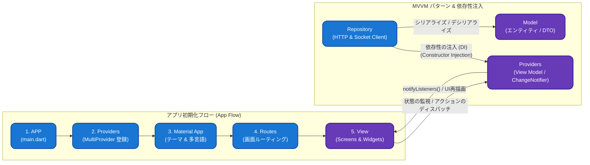
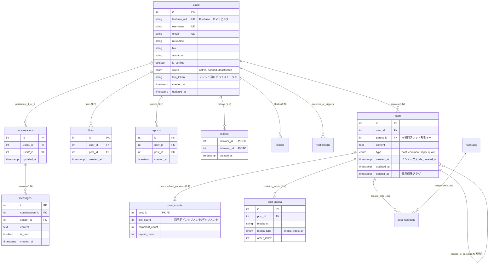
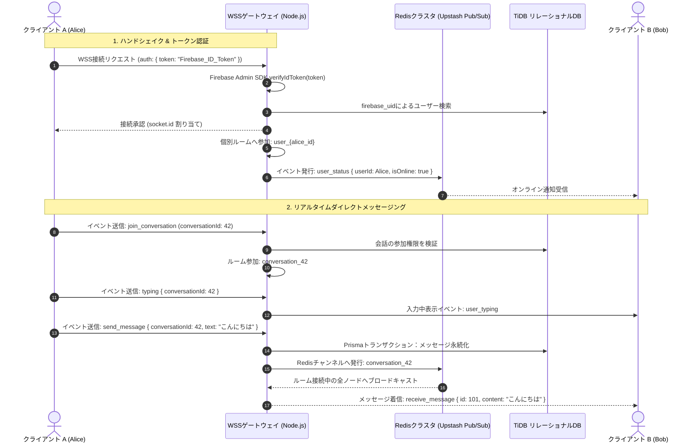

# 🧵🏙️ Thread City - スケーラブルなリアルタイム分散SNSエンジン & マルチプラットフォームクライアント

[Tiếng Việt](README.md) • [English](README.en.md) • [日本語](README.ja.md)

---

> **Thread City** は、Web SPAおよびモバイルネイティブ（Android / iOS）に対応した、高負荷耐性を備えた次世代マイクロブログ型分散ソーシャルネットワーク基盤です。クリーンなレイヤードアーキテクチャ、フィード取得を $O(1)$ に最適化する非正規化カウンターキャッシュ、Redis Pub/Subを活用した水平分散リアルタイムエンジン、およびGoogle暗号署名検証によるハイブリッド認証を採用しています。

---

## 🌐 1. 本番稼働環境（Live Production System）

本システムはクラウドインフラストラクチャ上で24時間365日独立稼働しています：

* 🖥️ **Webクライアント（本番環境）**: [https://thread-b4d7b.web.app](https://thread-b4d7b.web.app)
* ⚡ **バックエンドAPIゲートウェイ（Cloud Engine）**: [https://thread-city.onrender.com](https://thread-city.onrender.com)
* 🔌 **リアルタイムWebSocketゲートウェイ**: `wss://thread-city.onrender.com`
* 🗄️ **分散データベースノード**: TiDB Cloud Distributed MySQL Cluster (`ap-southeast-1` - シンガポール)
* ⚡ **インメモリキャッシュ & Pub/Sub**: Upstash Redis Enterprise with TLS Encryption (`ap-southeast-1` - シンガポール)
* 🛡️ **認証 & メディアストレージ**: Firebase Spark Infrastructure (Auth, Realtime DB, Storage Bucket, FCM)

---

## 🏛️ 2. システム全体アーキテクチャ（System Architecture Overview）

本システムは **Distributed Monolith Ready-to-Microservices** モデルを採用し、クライアント層、エッジ/ゲートウェイ層、アプリケーション層、インメモリ仲介層、永続データ層の責務を明確に分離しています。

```mermaid
graph TD
    subgraph Client Layer [1. クライアント層 - マルチプラットフォーム]
        WebClient["Flutter Web SPA<br/>(CanvasKit / HTML Engine)"]
        MobileClient["Flutter Mobile<br/>(Android / iOS Impeller)"]
    end

    subgraph Edge Layer [2. エッジ & セキュリティゲートウェイ]
        CDN["Firebase Hosting CDN<br/>(エッジキャッシュ & 静的配信)"]
        ReverseProxy["Cloud Ingress Gateway<br/>(SSL/TLS 1.3 終端)"]
        CORS["CORS Dynamic Host Validator<br/>(オリジン検証 & モバイルバイパス)"]
    end

    subgraph Application Layer [3. バックエンドエンジン - Node.js & TypeScript]
        ExpressApp["Express.js 5.x REST Gateway<br/>(コントローラー、ミドルウェア、ルート)"]
        SocketEngine["Socket.IO 4.x WebSocket Gateway<br/>(ルーム管理 & プレゼンスエンジン)"]
        AuthGuard["Firebase Admin SDK<br/>(暗号署名JWTトークン検証)"]
        PrismaEngine["Prisma 6.x ORM Query Engine<br/>(コネクションプール & ACIDトランザクション)"]
    end

    subgraph Distributed Data Layer [4. 分散データ & メッセージブローカー層]
        RedisCluster[("Upstash Redis Cluster<br/>(Pub/Sub アダプター & セッション状態)")]
        DistributedDB[("TiDB Cloud Serverless<br/>(分散リレーショナルMySQLエンジン)")]
        MediaStorage[("Firebase Cloud Storage<br/>(暗号化マルチメディアCDNバケット)")]
    end

    WebClient -->|HTTPS 静的ファイル| CDN
    WebClient -->|HTTPS REST API / JSON| ReverseProxy
    MobileClient -->|HTTPS REST API / JSON| ReverseProxy
    WebClient -->|WSS / WebSocket トランスポート| SocketEngine
    MobileClient -->|WSS / WebSocket トランスポート| SocketEngine

    ReverseProxy --> CORS
    CORS --> ExpressApp

    ExpressApp --> AuthGuard
    SocketEngine --> AuthGuard

    ExpressApp --> PrismaEngine
    SocketEngine <-->|クラスタ水平スケーリング & ルーム同期| RedisCluster
    PrismaEngine <-->|コネクションプール / SSL Strict| DistributedDB
    Client Layer -.->|署名付き直接アップロード / ダウンロード| MediaStorage
```

---

## 📱 3. クライアントアーキテクチャ: App Flow & MVVMパターン

Flutterクライアントは **MVVM (Model - View - ViewModel)** パターン、**依存性の注入 (Dependency Injection)**、および単一方向の初期化パイプラインに従って構築されています：



### アーキテクチャの責務分離：
1. **アプリ起動フロー (`App Flow`)**:
   * `APP (main.dart)`: コアバインディングの初期化、Firebase SDKの起動、`AppConfig` からの環境変数読み込み。
   * `Providers (MultiProvider)`: 全てのViewModel（`AuthProvider`, `HomeProvider`, `PostProvider`, `MessageProvider`, `NotificationProvider`）のインスタンス生成と集中管理。
   * `Material App`: デザイントークン、カラースキーム、フォント、グローバルナビゲーターの登録。
   * `Routes`: 画面遷移（Named Routes）の型安全なハンドリング。
   * `View`: UIの宣言的描画を担当。
2. **MVVM & 依存性の注入 (DI)**:
   * **View**: `Consumer` や `context.watch()` により状態を監視し、`context.read()` でユーザー操作を発火。
   * **View Model (`Providers`)**: ドメイン状態を保持し、`notifyListeners()` を通じて必要なウィジェットのみを差分再描画。
   * **Dependencies Injection (DI)**: 独立した `Repository` クラスを各Providerのコンストラクタ経由で注入し、ネットワーク層とロジック層を完全疎結合化。
   * **Model**: 双方向JSON変換をサポートする不変（Immutable）データモデル。

---

## ⚙️ 4. サーバー内部構造 & リクエストパイプライン

Node.js/TypeScriptバックエンドは、**ミドルウェアパイプライン** および **Controller-Service-Repository-ORM** の階層化アーキテクチャを採用しています：

```mermaid
flowchart TD
    subgraph ClientReq ["クライアントイングレス"]
        HTTPReq["HTTP リクエスト (REST API)"]
        WSReq["WSS 接続 (WebSocket)"]
    end

    subgraph SecurityPipeline ["1. セキュリティ & ミドルウェアパイプライン"]
        CORS["CORS Dynamic Host Validator<br/>(オリジン検証 & モバイルバイパス)"]
        Helmet["Helmet セキュリティヘッダー<br/>(HSTS, クリックジャッキング, XSS保護)"]
        Logger["Morgan ロガー & Express JSON パーサー"]
        AuthGuard["AuthGuard ミドルウェア<br/>(Firebase Admin SDK verifyIdToken)"]
    end

    subgraph RouterLayer ["2. Express ルーティング層"]
        AuthRouter["/api/auth (authRoutes.ts)"]
        PostRouter["/api/posts (postRoutes.ts)"]
        UserRouter["/api/users (userRoutes.ts)"]
        MsgRouter["/api/messages (messageRoutes.ts)"]
        NotiRouter["/api/notifications (notificationRoutes.ts)"]
    end

    subgraph ControllerLayer ["3. コントローラー層 (ビジネスロジック)"]
        AuthCtrl["authController.ts"]
        PostCtrl["postController.ts"]
        UserCtrl["userController.ts"]
        MsgCtrl["messageController.ts"]
        NotiCtrl["notificationController.ts"]
    end

    subgraph RealtimeSubsystem ["4. リアルタイム Socket.IO サブシステム"]
        SocketGateway["Socket.IO サーバー (socket.ts)"]
        SocketAuth["ハンドシェイクトークン検証"]
        RoomManager["ルーム & プレゼンスマネージャー<br/>(user_{id}, conversation_{id})"]
        RedisAdapter["@socket.io/redis-adapter<br/>(クラスタ同期)"]
    end

    subgraph PersistenceLayer ["5. 永続データ & インメモリストレージ"]
        PrismaORM["Prisma 6.x ORM エンジン<br/>(コネクションプール & $transaction)"]
        TiDBDB[("TiDB Cloud 分散リレーショナルMySQL<br/>(Users, Posts, Messages, Counts)")]
        UpstashRedis[("Upstash Redis クラスタ (TLS)<br/>(Pub/Sub チャンネル & セッション状態)")]
    end

    HTTPReq --> CORS
    CORS --> Helmet --> Logger --> AuthGuard

    AuthGuard --> AuthRouter --> AuthCtrl
    AuthGuard --> PostRouter --> PostCtrl
    AuthGuard --> UserRouter --> UserCtrl
    AuthGuard --> MsgRouter --> MsgCtrl
    AuthGuard --> NotiRouter --> NotiCtrl

    WSReq --> SocketGateway
    SocketGateway <--> SocketAuth
    SocketGateway <--> RoomManager
    RoomManager <--> RedisAdapter
    RedisAdapter <-->|Redis Protocol SSL| UpstashRedis

    AuthCtrl & PostCtrl & UserCtrl & MsgCtrl & NotiCtrl --> PrismaORM
    RoomManager -.->|メッセージ & ステータス保存| PrismaORM
    PrismaORM <-->|MySQL Protocol (Strict SSL)| TiDBDB
```

---

## 🛠️ 5. 技術選定理由（Technology Stack & Technical Rationale）

| レイヤー | 採用技術 | 技術選定の理由・優位性（Engineering Rationale） |
| :--- | :--- | :--- |
| **Frontend Framework** | **Flutter 3.x (Dart)** | 単一コードベース（Single Codebase）でWeb・Android・iOSを展開。Impeller/CanvasKitによる60〜120 FPSの高品位レンダリング。 |
| **State Management** | **Provider + ChangeNotifier** | ビジネスロジックをUIから完全に分離するリアクティブステート管理。Selectorパターンによる局所的再描画の最小化。 |
| **Backend Runtime** | **Node.js (v20+) + TypeScript** | ノンブロッキングI/Oイベントループにより大量の同時接続を処理。`NodeNext` ESM準拠の厳格な型安全性。 |
| **REST Framework** | **Express.js 5.x** | ルーティング性能向上とミドルウェア内でのネイティブPromiseサポートによる未補足例外の防止。 |
| **ORM Framework** | **Prisma 6.x** | スキーマから自動生成される完全な型安全クエリクライアント。ネストされた書き込みにおけるACIDトランザクション（`$transaction`）の保証。 |
| **Relational Database** | **TiDB Cloud (Distributed MySQL)** | 100% MySQLプロトコル互換のサーバーレス分散DB。負荷に応じた自動スケールと単一障害点（SPOF）の排除。 |
| **Realtime Gateway** | **Socket.IO 4.x + Redis Adapter** | 双方向WebSocketとRedis Pub/Subを統合し、複数サーバーノード間でのリアルタイム通信の同期・水平スケーリングを実現。 |
| **In-Memory Store** | **Upstash Redis (TLS Protocol)** | マイクロ秒単位の低遅延メッセージング。`rediss://`によるSSL暗号化通信の義務付け。 |
| **Identity & Security** | **Firebase Auth + Admin SDK** | ハイブリッド認証：クライアント側での迅速なOAuth/パスワードレスログインと、サーバー側でのGoogle公開鍵によるJWT暗号署名検証。 |

---

## 📁 6. ディレクトリ構成（Project Directory Structure）

```text
Thread-City-/
├── lib/                                    # Flutterクライアントソースコード（Web & Mobile）
│   ├── auth/                               # 認証・登録画面
│   ├── core/
│   │   ├── config/
│   │   │   └── app_config.dart             # コンパイル時環境変数注入（String.fromEnvironment）
│   │   └── theme/                          # タイポグラフィ、カラートークン、テーマ定義
│   ├── data/
│   │   ├── models/                         # DTO（Data Transfer Objects）：User, Post, Message等
│   │   └── repositories/                   # ネットワーク通信・API抽象化レイヤー
│   ├── providers/                          # 状態管理・ビジネスロジック層（ChangeNotifier）
│   ├── screens/                            # メイン画面ビュー（Home, Search, Chat, Profile, Activity）
│   ├── services/                           # バックグラウンドサービス（SocketService, ImageUpload, FCM）
│   └── widgets/                            # 再利用可能UIコンポーネント（PostCard, BouncyTap, VideoWidget）
│
├── server/                                 # バックエンドエンジンソースコード（Node.js + TypeScript）
│   ├── prisma/
│   │   ├── schema.prisma                   # データベーススキーマの単一の真実源（Single Source of Truth）
│   │   ├── migrations/                     # バージョン管理されたマイグレーション履歴
│   │   └── seed.ts                         # 初期シードデータ投入スクリプト
│   ├── src/
│   │   ├── config/
│   │   │   └── cors.ts                     # 動的CORSホワイトリスト & モバイルバイパス
│   │   ├── controllers/                    # リクエスト処理・ビジネスロジック
│   │   ├── middlewares/                    # 認証トークン検証・ルートガード
│   │   ├── routes/                         # RESTful APIエンドポイント定義
│   │   ├── services/
│   │   │   ├── firebaseService.ts          # Firebase Admin SDK初期化（マルチ環境対応）
│   │   │   └── redisService.ts             # Redis接続・ユーティリティ
│   │   ├── socket.ts                       # Socket.IOサーバー、Redisアダプター、ルーム管理
│   │   └── index.ts                        # サーバーエントリーポイント & HTTP/Socket統合
│   ├── Dockerfile                          # マルチステージビルド本番用コンテナ定義（Alpine Linux）
│   ├── docker-compose.prod.yml             # 本番用Dockerスタック定義
│   ├── package.json                        # 依存関係マニフェスト & ビルドスクリプト
│   └── tsconfig.json                       # TypeScriptコンパイラ設定（ES2022, NodeNext）
│
├── web/                                    # Web SPA設定（index.html, Service Workers, Manifest）
└── firebase.json                           # Firebase Hosting設定 & SPAリライトルール
```

---

## 🗄️ 7. データベース設計とデータモデリング（Data Modeling & ERD）



---

## ⚡ 8. リアルタイム通信と分散Pub/Subプロトコル



---

## 🔒 9. セキュリティアーキテクチャ & ネットワークガバナンス

1. **ハイブリッド二重認証（Double-Validation Flow）**:
   * クライアントはFirebase Authenticationで認証し、RS256暗号化されたID Tokenを取得。
   * バックエンドは **Firebase Admin SDK** を用いてGoogle公開鍵サーバーと暗号学的改ざんを検証。
2. **動的CORSホワイトリストエンジン**:
   * 公式フロントエンド（`https://thread-b4d7b.web.app`）を厳格にホワイトリスト化。
   * モバイルネイティブ通信（`Origin` ヘッダーが未定義または `null`）を透過。
   * OPTIONSプリフライトリクエストにおける `Content-Type`, `Authorization`, `ngrok-skip-browser-warning` を許可。

---

## 📡 10. RESTful API 仕様一覧

| メソッド | エンドポイント | パラメータ / ボディ | 機能概要 |
| :--- | :--- | :--- | :--- |
| `POST` | `/api/auth/register` | `{ firebase_uid, email, username, nickname }` | ユーザー登録およびMySQLへのプロファイル同期 |
| `GET` | `/api/auth/by-uid/:uid` | `uid`: Firebase UID | Firebase UIDに基づくユーザー情報の照会 |
| `GET` | `/api/posts` | `?firebase_uid=...&following=true/false` | フィード一覧の取得（For You / Following） |
| `POST` | `/api/posts` | `{ firebase_uid, content, parent_id, type, media }` | 投稿作成、スレッド返信、コメント投稿 |
| `GET` | `/api/posts/:id/replies` | `id`: 投稿ID | 指定投稿に紐づく返信スレッドの取得 |
| `POST` | `/api/posts/:id/like` | `{ firebase_uid }` | いいね状態の原子的切り替え（Toggle Like） |
| `POST` | `/api/posts/:id/repost` | `{ firebase_uid }` | リポスト状態の原子的切り替え（Toggle Repost） |
| `GET` | `/api/users/:firebase_uid` | `?viewer_uid=...` | ユーザープロファイル・フォロワー数の取得 |
| `POST` | `/api/users/follow` | `{ follower_uid, following_uid }` | ユーザーのフォロー実行 |
| `POST` | `/api/users/unfollow` | `{ follower_uid, following_uid }` | ユーザーのフォロー解除 |
| `GET` | `/api/messages/conversations` | `Bearer Token` | 会話スレッド一覧の取得 |
| `GET` | `/api/messages/:conversationId` | `Bearer Token` | 特定の会話内のメッセージ履歴取得 |
| `GET` | `/api/notifications` | `?firebase_uid=...` | アクション通知一覧の取得 |

---

## ⚡ 11. パフォーマンス最適化 & 高負荷対策

1. **Keep-Alive Cloud Daemon**:
   * [cron-job.org](https://cron-job.org/) を利用し、10分間隔で `HEAD /` に対する自動Pingを実行。インスタンススリープを完全防止。
2. **Service Worker によるメディアストリーミング最適化**:
   * `web/media_sw.js` により、HTTP 206 Byte-Rangeリクエスト（動画再生）をブラウザCache APIをバイパスして直接転送。`ERR_CACHE_OPERATION_NOT_SUPPORTED` を根絶。
3. **データベースコネクションプーリング**:
   * Prisma EngineによるTCP Keep-AliveおよびSSL Strict接続プールの維持。

---

## 👥 開発者情報 & ライセンス

* **System Architect & Full-Stack Developer**: Thanh Hậu
* **GitHub Repository**: [https://github.com/aimachinius/Thread-City-](https://github.com/aimachinius/Thread-City-)
* **License**: **MIT License** に基づくオープンソース。
