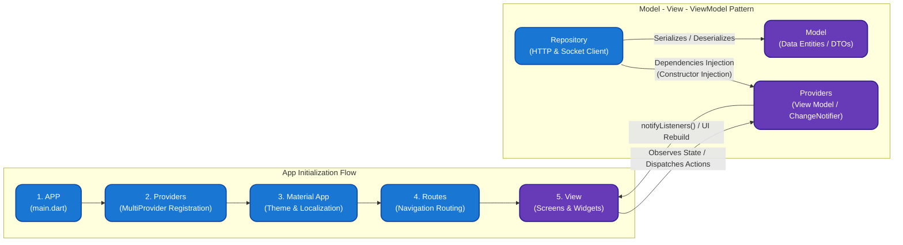
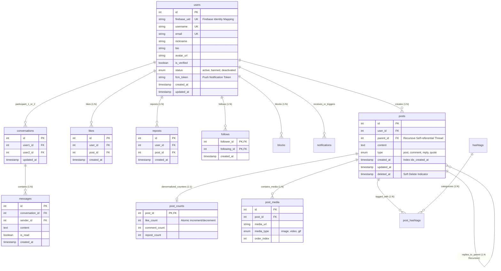
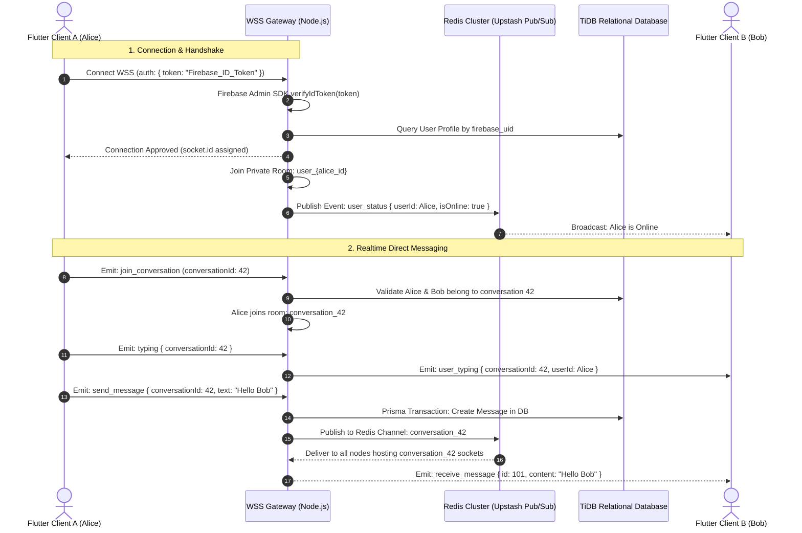

# 🧵🏙️ Thread City - Scalable Realtime Social Network Engine & Multi-Platform Client

[Tiếng Việt](README.md) • [English](README.en.md) • [日本語](README.ja.md)

---

> **Thread City** là một nền tảng mạng xã hội Micro-Blogging phân tán đa nền tảng (Web SPA & Mobile Native), được xây dựng với mục tiêu chịu tải cao, giao tiếp thời gian thực (Realtime), độ trễ thấp và tính nhất quán dữ liệu nghiêm ngặt. Hệ thống áp dụng các tiêu chuẩn kỹ thuật cấp doanh nghiệp: Kiến trúc phân lớp (Layered Architecture), Cơ chế bộ đệm phi chuẩn hóa (Denormalized Counter Cache), Động cơ Realtime chịu tải phân tán qua Redis Pub/Sub, và Hệ thống xác thực kết hợp (Hybrid Authentication).

---

## 🌐 1. Live Production System

Hệ thống hiện đã được triển khai hoàn chỉnh và đang vận hành trực tuyến 24/7 độc lập trên hạ tầng Cloud:

* 🖥️ **Web Application (Production Client)**: [https://thread-b4d7b.web.app](https://thread-b4d7b.web.app)
* ⚡ **Core Backend API Gateway (Cloud Engine)**: [https://thread-city.onrender.com](https://thread-city.onrender.com)
* 🔌 **Realtime WebSocket Gateway**: `wss://thread-city.onrender.com`
* 🗄️ **Distributed Database Node**: TiDB Cloud Distributed MySQL Cluster (`ap-southeast-1` - Singapore)
* ⚡ **In-Memory Cache & Pub/Sub Cluster**: Upstash Redis Enterprise with TLS Encryption (`ap-southeast-1` - Singapore)
* 🛡️ **Identity & Media Storage**: Firebase Spark Infrastructure (Auth, Realtime DB, Storage Bucket, FCM)

---

## 🏛️ 2. High-Level System Architecture

Hệ thống được thiết kế theo mô hình **Distributed Monolith Ready-to-Microservices**, phân tách rõ ràng trách nhiệm giữa Client, Edge/Gateway, Application Server, In-memory Broker và Persistent Storage.

```mermaid
graph TD
    subgraph Client Layer [1. Client Layer - Cross Platform]
        WebClient["Flutter Web SPA<br/>(CanvasKit / HTML Engine)"]
        MobileClient["Flutter Mobile<br/>(Android / iOS Impeller)"]
    end

    subgraph Edge Layer [2. Edge & Security Gateway]
        CDN["Firebase Hosting CDN<br/>(Edge Caching & Static Assets)"]
        ReverseProxy["Cloud Ingress Gateway<br/>(SSL/TLS 1.3 Termination)"]
        CORS["CORS Dynamic Host Validator<br/>(Origin Whitelist & Null-bypass)"]
    end

    subgraph Application Layer [3. Backend Application Engine - Node.js & TypeScript]
        ExpressApp["Express.js 5.x REST Gateway<br/>(Controllers, Middlewares, Routes)"]
        SocketEngine["Socket.IO 4.x WebSocket Gateway<br/>(Room Management & Presence Engine)"]
        AuthGuard["Firebase Admin SDK<br/>(Decoded JWT Token Validator)"]
        PrismaEngine["Prisma 6.x ORM Query Engine<br/>(Connection Pooling & ACID Transactions)"]
    end

    subgraph Distributed Data Layer [4. Distributed Persistence & Pub/Sub Layer]
        RedisCluster[("Upstash Redis Cluster<br/>(Pub/Sub Adapter & In-Memory State)")]
        DistributedDB[("TiDB Cloud Serverless<br/>(Distributed Relational MySQL Engine)")]
        MediaStorage[("Firebase Cloud Storage<br/>(Encrypted Multimedia CDN Bucket)")]
    end

    WebClient -->|HTTPS Static Assets| CDN
    WebClient -->|HTTPS REST API / JSON| ReverseProxy
    MobileClient -->|HTTPS REST API / JSON| ReverseProxy
    WebClient -->|WSS / WebSocket Transport| SocketEngine
    MobileClient -->|WSS / WebSocket Transport| SocketEngine

    ReverseProxy --> CORS
    CORS --> ExpressApp

    ExpressApp --> AuthGuard
    SocketEngine --> AuthGuard

    ExpressApp --> PrismaEngine
    SocketEngine <-->|Cluster Horizontal Scaling & Rooms| RedisCluster
    PrismaEngine <-->|Connection Pool / SSL Strict| DistributedDB
    Client Layer -.->|Direct Signed Upload / Download| MediaStorage
```

---

## 📱 3. Client Architecture: App Flow & MVVM Pattern

Ứng dụng Flutter được tổ chức theo kiến trúc **MVVM (Model - View - ViewModel)** kết hợp kỹ thuật tiêm phụ thuộc **Dependency Injection (DI)** và luồng khởi tạo ứng dụng phân cấp một chiều:



### Chi tiết luồng vận hành (Execution Flow):
1. **Khởi tạo (`App Flow`)**:
   * `APP (main.dart)`: Điểm nhập (Entry point) khởi động các bindings lõi, đăng ký Firebase Client SDK và tải cấu hình động từ `AppConfig`.
   * `Providers (MultiProvider)`: Nơi tập trung khởi tạo toàn bộ các ViewModels (`AuthProvider`, `HomeProvider`, `PostProvider`, `MessageProvider`, `NotificationProvider`).
   * `Material App`: Thiết lập Design System, Typography, Color Palette và Root Navigator.
   * `Routes`: Quản lý điều hướng màn hình an toàn (Named Routes / Screen Routing).
   * `View`: Các widget hiển thị thuần túy (Scaffold, Screens, Cards) chỉ chịu trách nhiệm vẽ giao diện.

2. **Mô hình tương tác (`MVVM & Dependency Injection`)**:
   * **View**: Đăng ký lắng nghe dữ liệu từ `Providers` (`context.watch()`, `Consumer`) và kích hoạt hành động người dùng (`context.read()`).
   * **View Model (`Providers`)**: Nắm giữ trạng thái nghiệp vụ (State), điều phối luồng dữ liệu và phát tín hiệu `notifyListeners()` để View cập nhật lại đúng Widget cần thiết mà không render lại toàn bộ màn hình.
   * **Dependencies Injection (DI)**: Các tầng `Repository` độc lập (`AuthRepository`, `PostRepository`,...) được tiêm thẳng vào Constructor của từng Provider, tách biệt hoàn toàn tầng logic khỏi tầng mạng (Network).
   * **Model**: Các Data Transfer Objects (DTOs) bất biến (`User`, `Post`, `Message`, `Conversation`) hỗ trợ serialization/deserialization JSON hai chiều.

---

## ⚙️ 4. Server Internal Architecture & Request Pipeline

Kiến trúc nội tại của Backend Server (Node.js + Express + TypeScript) được tổ chức theo đường ống dẫn xử lý yêu cầu (**Middleware Request Pipeline**) và phân tách theo mô hình **Controller-Service-Repository-ORM Layer**:

```mermaid
flowchart TD
    subgraph ClientReq ["Client Ingress"]
        HTTPReq["HTTP Request (REST API)"]
        WSReq["WSS Connection (WebSocket)"]
    end

    subgraph SecurityPipeline ["1. Security & Middleware Pipeline"]
        CORS["CORS Dynamic Host Validator<br/>(Origin Whitelist & Null-bypass)"]
        Helmet["Helmet Security Headers<br/>(HSTS, Clickjacking, XSS Protection)"]
        Logger["Morgan Logger & Express JSON Parser"]
        AuthGuard["AuthGuard Middleware<br/>(Firebase Admin SDK verifyIdToken)"]
    end

    subgraph RouterLayer ["2. Express Routing Layer"]
        AuthRouter["/api/auth (authRoutes.ts)"]
        PostRouter["/api/posts (postRoutes.ts)"]
        UserRouter["/api/users (userRoutes.ts)"]
        MsgRouter["/api/messages (messageRoutes.ts)"]
        NotiRouter["/api/notifications (notificationRoutes.ts)"]
    end

    subgraph ControllerLayer ["3. Business Controllers Layer"]
        AuthCtrl["authController.ts"]
        PostCtrl["postController.ts"]
        UserCtrl["userController.ts"]
        MsgCtrl["messageController.ts"]
        NotiCtrl["notificationController.ts"]
    end

    subgraph RealtimeSubsystem ["4. Realtime Socket.IO Subsystem"]
        SocketGateway["Socket.IO Server (socket.ts)"]
        SocketAuth["Handshake Token Verification"]
        RoomManager["Room & Presence Manager<br/>(user_{id}, conversation_{id})"]
        RedisAdapter["@socket.io/redis-adapter<br/>(Cross-node Sync)"]
    end

    subgraph PersistenceLayer ["5. Persistence & In-Memory Storage"]
        PrismaORM["Prisma 6.x ORM Engine<br/>(Connection Pooling & $transaction)"]
        TiDBDB[("TiDB Cloud Distributed MySQL<br/>(Users, Posts, Messages, Counts)")]
        UpstashRedis[("Upstash Redis Cluster (TLS)<br/>(Pub/Sub Channels & Realtime State)")]
    end

    HTTPReq --> CORS
    CORS --> Helmet --> Logger --> AuthGuard

    AuthGuard --> AuthRouter --> AuthCtrl
    AuthGuard --> PostRouter --> PostCtrl
    AuthGuard --> UserRouter --> UserCtrl
    AuthGuard --> MsgRouter --> MsgCtrl
    AuthGuard --> NotiRouter --> NotiCtrl

    WSReq --> SocketGateway
    SocketGateway <--> SocketAuth
    SocketGateway <--> RoomManager
    RoomManager <--> RedisAdapter
    RedisAdapter <-->|Redis Protocol SSL| UpstashRedis

    AuthCtrl & PostCtrl & UserCtrl & MsgCtrl & NotiCtrl --> PrismaORM
    RoomManager -.->|Persist Chats & Status| PrismaORM
    PrismaORM <-->|MySQL Protocol (Strict SSL)| TiDBDB
```

### Vòng đời của một Request trên Server:
1. **Tầng Ingress & Middleware**:
   * Request từ Client đi qua bộ lọc CORS để xác thực domain nguồn.
   * `Helmet` gắn các tiêu chuẩn bảo mật HTTP Header cao cấp.
   * `express.json()` phân giải thân gói tin JSON.
   * `AuthGuard` giải mã chữ ký số của Bearer Token qua Firebase Admin SDK để xác thực danh tính.
2. **Tầng Routing & Controller**:
   * Điều hướng theo module tài nguyên (`/api/posts`, `/api/messages`,...).
   * Controller kiểm tra tính hợp lệ của dữ liệu đầu vào (Validation) và điều phối nghiệp vụ.
3. **Tầng ORM & Cơ sở dữ liệu**:
   * Controller sử dụng Prisma Client để giao tiếp với TiDB Cloud qua kết nối mã hóa SSL.
   * Các thao tác phức tạp (ví dụ: Tạo bài viết kèm ảnh + trích xuất hashtag + tạo bộ đếm) được bọc trong `prisma.$transaction` để đảm bảo tính toàn vẹn tuyệt đối (ACID).
4. **Phân hệ Realtime WebSocket**:
   * Xử lý song song với HTTP thông qua chung một `httpServer`.
   * Đồng bộ các sự kiện nhắn tin và trạng thái Online/Offline xuyên suốt giữa các worker node thông qua Redis Pub/Sub Adapter.

---

## 🛠️ 5. Technology Stack & Technical Rationale

| Thành phần | Lựa chọn kỹ thuật | Phân tích lý do & Lợi ích kỹ thuật (Engineering Rationale) |
| :--- | :--- | :--- |
| **Frontend Framework** | **Flutter 3.x (Dart)** | Đơn nhất hóa codebase (Single Codebase) cho cả Web, Android và iOS; đảm bảo hiệu năng dựng hình 60-120 FPS qua đồ họa Impeller/CanvasKit; quản lý trạng thái phản ứng linh hoạt. |
| **State Management** | **Provider + ChangeNotifier** | Mô hình quản lý trạng thái phản ứng (Reactive State Management) phân tách biệt lập giữa View và Data Stream; tối ưu Re-rendering thông qua Selector pattern. |
| **Backend Runtime** | **Node.js (v20+) + TypeScript** | Non-blocking I/O Event Loop xử lý hàng nghìn kết nối đồng thời. Hệ thống Type System chặt chẽ với cấu hình `NodeNext` ESM module resolution. |
| **REST Framework** | **Express.js 5.x** | Tối ưu hóa hiệu năng routing, native promise support trong middleware giúp giảm thiểu uncaught exceptions. |
| **ORM Framework** | **Prisma 6.x** | Quản lý vòng đời dữ liệu Type-Safe hoàn chỉnh (Client sinh tự động từ Schema); hỗ trợ Isolation Transaction (`$transaction`) cho các ghi chép lồng nhau. |
| **Relational Database** | **TiDB Cloud (Distributed MySQL)** | Động cơ MySQL phân tán chuẩn Serverless, tự động mở rộng theo lưu lượng truy cập; hỗ trợ ACID transaction toàn vẹn và giao thức mã hóa SSL Strict. |
| **Realtime Gateway** | **Socket.IO 4.x + Redis Adapter** | Kết hợp giao thức WebSocket hai chiều với Redis Adapter để đồng bộ trạng thái giữa nhiều tiến trình node server (Clustering/Multi-instance). |
| **In-Memory Store** | **Upstash Redis (TLS Protocol)** | Hỗ trợ kênh Pub/Sub thời gian thực và quản lý phòng chat, cache session tốc độ microsecond; sử dụng kết nối bảo mật `rediss://`. |
| **Identity & Security** | **Firebase Auth + Admin SDK** | Cơ chế xác thực kép: Phía client đăng nhập nhanh qua Google OAuth/Email; phía server thẩm định chữ ký số cryptographic của JWT trước khi cấp quyền API. |

---

## 📁 6. Project Directory Structure

```text
Thread-City-/
├── lib/                                    # Mã nguồn Flutter Client (Web & Mobile)
│   ├── auth/                               # Màn hình đăng nhập, đăng ký
│   │   ├── login_screen.dart
│   │   └── register_screen.dart
│   ├── core/                               # Cấu hình cốt lõi toàn ứng dụng
│   │   ├── config/
│   │   │   └── app_config.dart             # Dynamic Server URL Injection (String.fromEnvironment)
│   │   └── theme/                          # Typography, Color Tokens, Light/Dark theme
│   ├── data/
│   │   ├── models/                         # DTOs (Data Transfer Objects): User, Post, Message, ...
│   │   └── repositories/                   # Tầng trừu tượng hóa tương tác mạng (HTTP Repositories)
│   │       ├── auth_repository.dart
│   │       ├── post_repository.dart
│   │       ├── user_repository.dart
│   │       ├── message_repository.dart
│   │       └── notification_repository.dart
│   ├── providers/                          # Tầng nghiệp vụ & State Management (ChangeNotifier)
│   │   ├── auth_provider.dart
│   │   ├── home_provider.dart
│   │   ├── post_provider.dart
│   │   ├── message_provider.dart
│   │   └── notification_provider.dart
│   ├── screens/                            # Các màn hình chính (Home, Search, Chat, Profile, Activity)
│   ├── services/                           # Dịch vụ nền (SocketService, ImageUploadService, PushNoti)
│   └── widgets/                            # UI Components tái sử dụng (PostCard, BouncyTap, VideoWidget)
│
├── server/                                 # Mã nguồn Backend Engine (Node.js + Express + TypeScript)
│   ├── prisma/
│   │   ├── schema.prisma                   # Single Source of Truth cho toàn bộ cơ sở dữ liệu
│   │   ├── migrations/                     # Lịch sử các migration versioning
│   │   └── seed.ts                         # Script nạp dữ liệu mẫu ban đầu
│   ├── src/
│   │   ├── config/
│   │   │   └── cors.ts                     # Dynamic CORS Whitelist & Mobile Bypass Handler
│   │   ├── controllers/                    # Tầng xử lý nghiệp vụ yêu cầu (Business Request Handlers)
│   │   │   ├── authController.ts
│   │   │   ├── postController.ts
│   │   │   ├── userController.ts
│   │   │   ├── messageController.ts
│   │   │   └── notificationController.ts
│   │   ├── middlewares/                    # Middleware xác thực JWT, bảo mật route
│   │   ├── routes/                         # Định nghĩa Endpoints RESTful API
│   │   ├── services/
│   │   │   ├── firebaseService.ts          # Khởi tạo Firebase Admin SDK (Cloud/Local multi-target)
│   │   │   └── redisService.ts             # Redis Connection & Helper
│   │   ├── socket.ts                       # Socket.IO Server, Redis Adapter & Room Management
│   │   └── index.ts                        # Entry Point: Express HTTP Server & Socket Binding
│   ├── Dockerfile                          # Multi-stage production container build (Alpine Linux)
│   ├── docker-compose.prod.yml             # Cấu hình cụm container production độc lập
│   ├── package.json                        # Khai báo dependencies & build scripts
│   └── tsconfig.json                       # Cấu hình TypeScript compiler (ES2022, NodeNext)
│
├── web/                                    # Cấu hình Web SPA (index.html, service workers, manifest)
└── firebase.json                           # Cấu hình Hosting Rules & Single Page Application (SPA) rewrites
```

---

## 🗄️ 7. Database Schema & Data Modeling

Cơ sở dữ liệu của Thread City được thiết kế theo tiêu chuẩn Relational Model với độ phân rã cao, đồng thời áp dụng kỹ thuật **Phi chuẩn hóa có kiểm soát (Denormalization)** tại các điểm nóng truy vấn nhằm loại bỏ hoàn toàn các phép tính `COUNT(*)` đắt đỏ khi người dùng cuộn bảng tin (Infinite Scrolling).



### Các nguyên tắc cốt lõi trong Schema:
1. **Recursive Thread Tree (`posts.parent_id`)**: Cột `parent_id` liên kết đệ quy tới chính bảng `posts`. Một bản ghi có thể là một Bài đăng độc lập (`parent_id = NULL`), hoặc là Bình luận/Phản hồi (`parent_id != NULL`). Thiết kế này cho phép phân nhánh thảo luận đa cấp không giới hạn chiều sâu.
2. **Denormalized Counter Caching (`post_counts`)**: Bảng `post_counts` lưu giữ số đếm `like_count`, `comment_count`, `repost_count` tương ứng $1:1$ với từng bài viết. Khi người dùng bấm Like, hệ thống dùng Transaction nguyên tử để tạo bản ghi trong bảng `likes` đồng thời cập nhật `like_count = like_count + 1`. Nhờ đó truy vấn Feed đạt độ phức tạp $O(1)$ mà không cần `GROUP BY` hay `JOIN COUNT(*)`.
3. **Compound Unique Constraints**:
   - `UNIQUE(user_id, post_id)` trong bảng `likes` và `reposts` ngăn chặn hoàn toàn việc người dùng bấm like/repost 2 lần do mạng lag.
   - `PRIMARY KEY(follower_id, following_id)` trong bảng `follows` bảo đảm tính toàn vẹn tuyệt đối của đồ thị xã hội (Social Graph).
4. **Targeted Indexing**: Các chỉ mục `idx_created_at`, `idx_user_id`, `idx_parent_id` giúp tối ưu hóa truy vấn phân trang thời gian thực (Time-series Feed sorting) đạt tốc độ mili-giây.

---

## ⚡ 8. Realtime Gateway & WebSocket Protocols



---

## 🔒 9. Security Architecture & Network Governance

1. **Hybrid Double-Validation Authentication Flow**:
   * Phía Client đăng nhập qua Google Sign-In hoặc Email/Password bằng Firebase Authentication SDK và nhận `ID Token` (JWT có chữ ký mật mã RS256).
   * Phía Server giải mã và thẩm định chữ ký số thông qua **Firebase Admin SDK** độc lập trước khi cấp quyền truy cập các API được bảo vệ.
2. **Strict Dynamic CORS Configuration**:
   * Whitelist động các domain được cấp phép: `https://thread-b4d7b.web.app`, `https://thread-b4d7b.firebaseapp.com`.
   * Tự động cho phép các Client Mobile Native (`Origin` header là `null` hoặc không gửi).
   * Kiểm soát chặt chẽ các headers được phép: `Content-Type`, `Authorization`, `ngrok-skip-browser-warning`.

---

## 📡 10. RESTful API Specification

### Authentication Module (`/api/auth`)
| Method | Endpoint | Yêu cầu Body / Params | Mô tả chức năng |
| :--- | :--- | :--- | :--- |
| `POST` | `/api/auth/register` | `{ firebase_uid, email, username, nickname }` | Đăng ký hoặc đồng bộ user từ Firebase vào database MySQL |
| `GET` | `/api/auth/by-uid/:uid` | `uid`: Firebase UID chuỗi | Lấy thông tin user hiện tại theo Firebase UID |

### Post & Feed Module (`/api/posts`)
| Method | Endpoint | Query / Body Params | Mô tả chức năng |
| :--- | :--- | :--- | :--- |
| `GET` | `/api/posts` | `?firebase_uid=...&following=true/false` | Lấy danh sách bài viết trang Feed (Dành cho bạn / Đang theo dõi) |
| `POST` | `/api/posts` | `{ firebase_uid, content, parent_id, type, media }` | Tạo bài viết mới, trả lời bài viết hoặc bình luận |
| `GET` | `/api/posts/:id/replies` | `id`: Post ID | Lấy toàn bộ danh sách câu trả lời lồng nhau của bài viết |
| `POST` | `/api/posts/:id/like` | `{ firebase_uid }` | Bật/Tắt trạng thái Like bài viết (Atomic Toggle) |
| `POST` | `/api/posts/:id/repost` | `{ firebase_uid }` | Bật/Tắt chia sẻ lại bài viết lên trang cá nhân |
| `GET` | `/api/posts/user/:uid` | `uid`: Firebase UID, `?viewer_uid=...` | Lấy toàn bộ danh sách bài viết của một người dùng |

### User Social Graph (`/api/users`)
| Method | Endpoint | Query / Body Params | Mô tả chức năng |
| :--- | :--- | :--- | :--- |
| `GET` | `/api/users/:firebase_uid` | `?viewer_uid=...` | Lấy hồ sơ người dùng kèm số đếm Followers, Following |
| `POST` | `/api/users/follow` | `{ follower_uid, following_uid }` | Thực hiện theo dõi người dùng khác |
| `POST` | `/api/users/unfollow` | `{ follower_uid, following_uid }` | Hủy theo dõi người dùng |
| `GET` | `/api/users/:userId/followers` | `userId`: User ID số | Lấy danh sách những người đang theo dõi |
| `GET` | `/api/users/:userId/following` | `userId`: User ID số | Lấy danh sách những người mình đang theo dõi |

### Direct Messaging & Notifications (`/api/messages`, `/api/notifications`)
| Method | Endpoint | Yêu cầu | Mô tả chức năng |
| :--- | :--- | :--- | :--- |
| `GET` | `/api/messages/conversations` | `Bearer Token` | Lấy danh sách các cuộc trò chuyện gần nhất |
| `GET` | `/api/messages/:conversationId` | `Bearer Token` | Lấy lịch sử tin nhắn trong cuộc trò chuyện |
| `GET` | `/api/notifications` | `?firebase_uid=...` | Lấy danh sách thông báo tương tác (Like, Comment, Follow) |

---

## ⚡ 11. Performance Optimizations & High-Load Strategies

1. **Keep-Alive Cloud Daemon**:
   * Tích hợp cơ chế Ping tự động tần suất 10 phút/lần qua [cron-job.org](https://cron-job.org/) đến endpoint `HEAD /` của Render Server, ngăn chặn hoàn toàn hiện tượng Cold-Start / Sleep của gói Cloud Free.
2. **Network Resilience & Auto-Retry**:
   * Tầng Repository trong Flutter cài đặt giải thuật thử lại (Retry with exponential backoff) khi gặp độ trễ mạng tạm thời, đảm bảo ứng dụng không bao giờ bị văng màn hình trắng.
3. **Database Connection Pooling**:
   * Prisma Engine tự động duy trì một Connection Pool linh hoạt tới TiDB Cloud qua giao thức TCP Keep-Alive và SSL Strict, tối ưu số lượng truy vấn đồng thời mà không làm quá tải CPU máy chủ cơ sở dữ liệu.
4. **Cache API Range-Request Bypass**:
   * File `web/index.html` đăng ký một Service Worker chuyên dụng (`media_sw.js`) để chặn và chuyển tiếp thẳng các yêu cầu byte-range HTTP 206 (Video Streaming) từ Firebase Storage mà không đi qua Cache API của trình duyệt, triệt tiêu lỗi `ERR_CACHE_OPERATION_NOT_SUPPORTED` kinh điển của Flutter Web.

---

## 👥 Authors & Engineering Credits

* **System Architect & Full-Stack Developer**: Thanh Hậu
* **Repository**: [https://github.com/aimachinius/Thread-City-](https://github.com/aimachinius/Thread-City-)
* **License**: Open Source under the **MIT License**.
